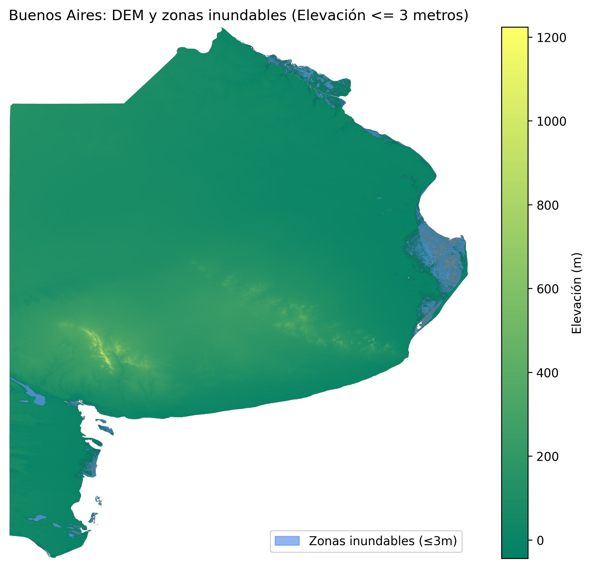

# Análisis de Zonas Inundables en Buenos Aires

Este proyecto analiza zonas potencialmente inundables en Buenos Aires utilizando un Modelo Digital de Elevación (DEM). El análisis identifica áreas con elevación menor o igual a 3 metros sobre el nivel del mar, consideradas vulnerables a inundaciones.



## Descripción

El proyecto utiliza datos geoespaciales para crear una máscara binaria que resalta las zonas de riesgo de inundación. El notebook `flood_notebook.ipynb` procesa el archivo `bsas.tif` (DEM de Buenos Aires), genera una máscara de inundación y produce visualizaciones.

### Funcionalidades principales:
- Carga y análisis de datos DEM
- Creación de máscara para elevaciones ≤ 3m
- Generación de visualizaciones superpuestas
- Exportación de resultados en formato TIFF y PNG

## Instalación

1. Clona este repositorio:
   ```bash
   git clone https://github.com/tu-usuario/bs_as_flood.git
   cd bs_as_flood
   ```

2. Instala las dependencias:
   ```bash
   pip install -r requirements.txt
   ```

## Uso

1. Abre el notebook `flood_notebook.ipynb` en Jupyter Notebook o JupyterLab:
   ```bash
   jupyter notebook flood_notebook.ipynb
   ```

2. Ejecuta las celdas del notebook en orden. El notebook incluye:
   - Exploración inicial de los datos DEM
   - Creación de la máscara de inundación
   - Generación de visualizaciones
   - Exportación de resultados

## Archivos del proyecto

- `flood_notebook.ipynb`: Notebook principal con el análisis
- `bsas.tif`: Modelo Digital de Elevación de Buenos Aires
- `mask.tif`: Máscara binaria de zonas inundables generada
- `zonas_inundables_bsas.png`: Visualización final de las zonas inundables
- `requirements.txt`: Dependencias de Python necesarias
- `LICENSE`: Licencia MIT
- `.gitignore`: Archivos ignorados por Git

## Dependencias

Las principales librerías utilizadas son:
- `rasterio`: Para manejo de datos geoespaciales
- `matplotlib`: Para creación de gráficos y visualizaciones
- `numpy`: Para operaciones con arrays

## Resultados

El análisis produce:
- Una máscara binaria donde 1 representa zonas inundables (elevación ≤ 3m)
- Visualizaciones superpuestas del DEM con las zonas de riesgo
- Archivos exportados listos para uso en SIG o análisis adicionales

## Contribución

Si deseas contribuir al proyecto:
1. Haz un fork del repositorio
2. Crea una rama para tu feature (`git checkout -b feature/nueva-funcionalidad`)
3. Commit tus cambios (`git commit -am 'Agrega nueva funcionalidad'`)
4. Push a la rama (`git push origin feature/nueva-funcionalidad`)
5. Abre un Pull Request

## Licencia

Este proyecto está bajo la Licencia MIT. Ver el archivo `LICENSE` para más detalles.

## Autor

Andrea Soledad Guerra

## Contacto

Para preguntas o sugerencias, por favor abre un issue en el repositorio.
